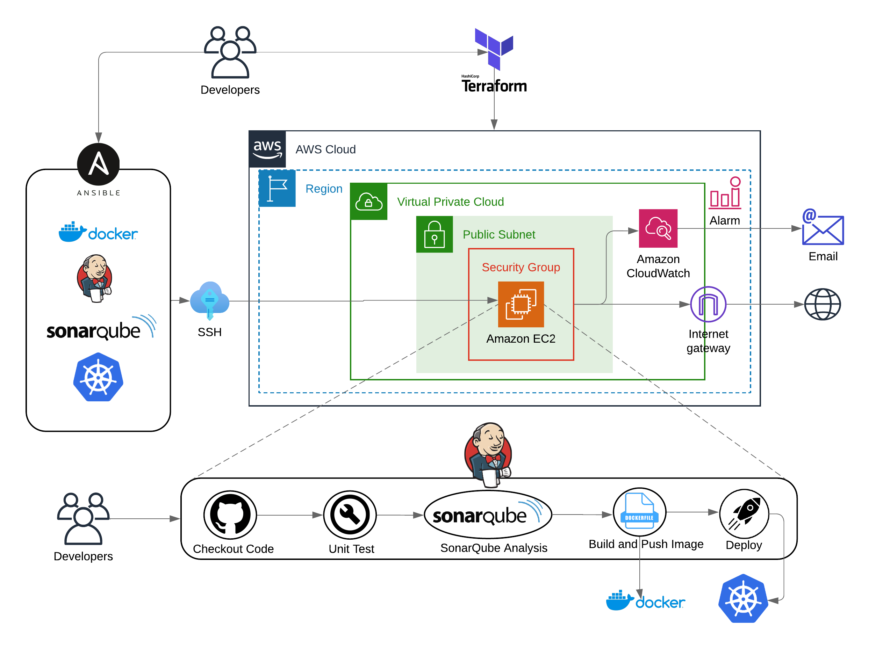

# CloudDevOpsProject

This project demonstrates a complete Cloud DevOps pipeline, utilizing Terraform for infrastructure provisioning, Ansible for configuration management, and Jenkins for continuous integration. The application is containerized using Docker and deployed to AWS EC2 instances managed through Terraform. The CI/CD pipeline ensures seamless code integration and deployment to Kubernetes.

## Project Overview

This repository includes the following main sections:
1. **Infrastructure Provisioning with Terraform**
2. **Configuration and Automation with Ansible on EC2 provisioned by Terraform**
3. **Continuous Integration Pipeline using Jenkins**

Each section is detailed in its respective README file, which you can refer to for specific instructions and configurations.

---

## 1. Infrastructure Provisioning with Terraform

In this section, we use Terraform to provision the necessary AWS resources for the project. This includes:

- VPC, Subnet, and Security Groups.
- EC2 instance for application deployment.

Terraform modules are used to structure the configuration for reusability and scalability. You can find detailed steps on provisioning the infrastructure in the [Terraform README](./Terraform/README.md).

---

## 2. Configuration and Automation with Ansible on EC2

After provisioning the EC2 instance using Terraform, we use Ansible to automate the configuration of the instance. The tasks include:

- Installing necessary packages such as Git, Docker, Java, Jenkins, Minikube and SonarQube.
- Setting up environment variables and configuring the instance to run the application.

This section uses Ansible roles and dynamic inventory for better organization and reusability. Detailed steps can be found in the [Ansible README](./Ansible/README.md).

---

## 3. Continuous Integration Pipeline using Jenkins

In this section, we set up a Jenkins pipeline that automates the CI/CD process. The pipeline includes the following stages:

- Git Checkout
- Unit Test
- Build JAR
- SonarQube Test
- Build Image
- Push Image to Docker Registry
- Deploy on Minikube

We also use a shared Jenkins library for efficient pipeline execution. For detailed configuration, check the [Jenkins README](./Jenkins/README.md).

---

## Setup Instructions

To get started, follow the instructions in the respective README files for each section. These will guide you through setting up the infrastructure, configuring the EC2 instance, and setting up the Jenkins pipeline.

---
