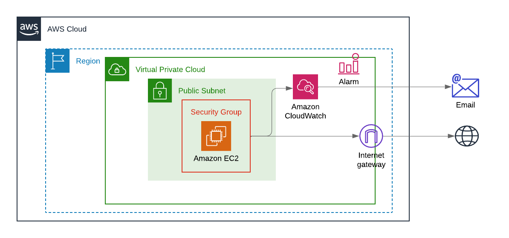
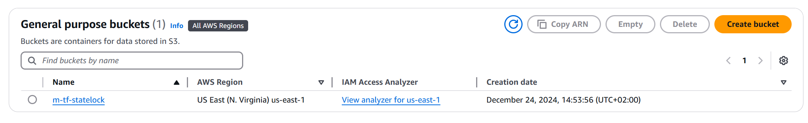
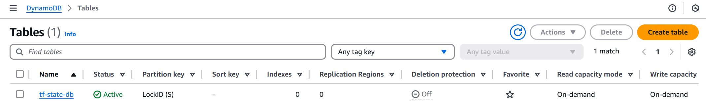
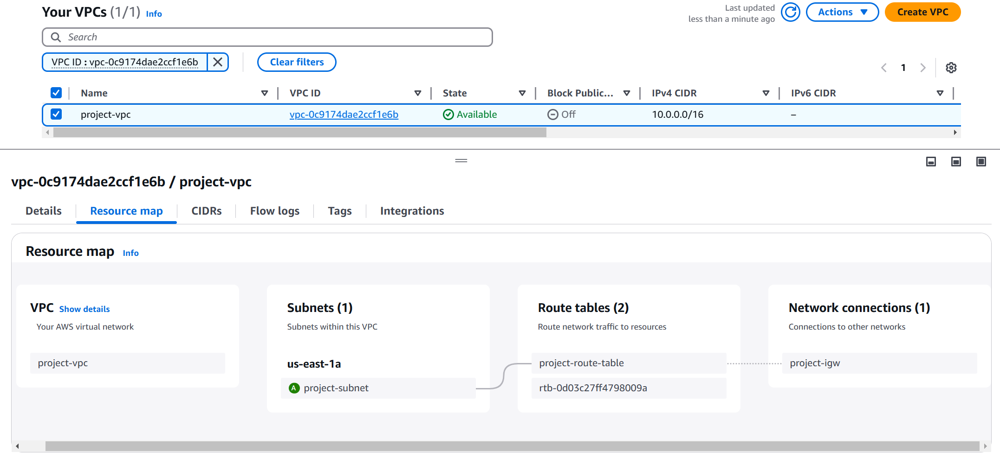
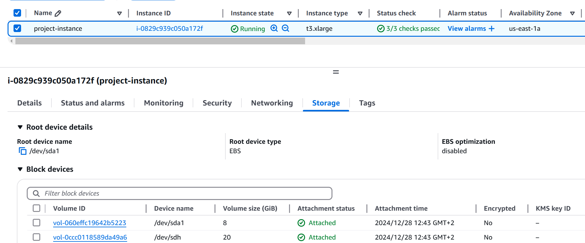
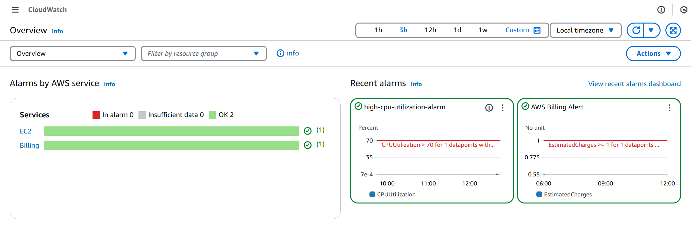

# Terraform Infrastructure Provisioning

This section contains the Terraform scripts for provisioning the cloud infrastructure on AWS. The infrastructure includes a Virtual Private Cloud (VPC), subnet, EC2 instance, and CloudWatch for monitoring. Terraform modules are used for better code reuse and organization.




## Overview

### Provisioned Resources:
- **VPC**: A Virtual Private Cloud is created with the specified CIDR block.
- **Subnet**: Public subnet is configured within the VPC.
- **EC2 Instance**: A general-purpose EC2 instance is provisioned for application deployment.
- **CloudWatch Alarms**: CloudWatch monitoring is set up to trigger alarms based on specific metrics.

### Files and Modules:
- **main.tf**: Contains the primary resource definitions and module references.
- **variables.tf**: Defines input variables for the Terraform configuration.
- **terraform.tfvars**: Holds the variable values for deployment (such as CIDR blocks, instance types, etc.).
- **providers.tf**: Configures the AWS provider for Terraform.
- **backend.tf**: Configures the **S3** and **DynamoDB** backend for storing Terraform state files.
  
  
  
  
- **ec2-module**: A module for provisioning EC2 instances.
- **vpc-module**: A module for provisioning the VPC, including subnets and security groups.
- **cw-module**: A module for configuring CloudWatch alarms and notifications.

## Setup Instructions

To deploy the infrastructure, follow these steps:

### 1. **Configure AWS Credentials**
Make sure your AWS credentials are set up to allow Terraform to create resources in your account. You can configure your credentials using the AWS CLI:

```bash
aws configure
```

### 2. **Initialize Terraform**
Navigate to the Terraform directory and run the following command to initialize the Terraform environment and download the required provider plugins:

```bash
terraform init
```

### 3. **Apply Terraform Configuration**
Once Terraform is initialized, apply the configuration to provision the resources:

```bash
terraform apply
```

Terraform will prompt you to confirm before proceeding with resource creation.

### 4. **Destroy Resources**
If you wish to clean up the resources, you can destroy everything provisioned by Terraform:

```bash
terraform destroy
```

## Terraform Files Breakdown

### main.tf
This is the main Terraform configuration file that references the modules responsible for provisioning the VPC, EC2 instance, and CloudWatch alarms.

```hcl
module "vpc" {
  source  = "./vpc-module"
  vpc_cidr    = var.vpc_cidr
  subnet_cidr = var.subnet_cidr
}

module "ec2" {
  depends_on   = [module.vpc]
  source       = "./ec2-module"
  subnet_id    = module.vpc.public_subnet_id
  instance_type = var.instance_type
  key_name      = var.key_name
  vpc_id        = module.vpc.vpc_id
  EBS_size      = var.EBS_size
}

module "cw" {
  depends_on = [module.ec2]
  source     = "./cw-module"
  cw_alarm_name          = var.cw_alarm_name
  cw_comparison_operator = var.cw_comparison_operator
  cw_evaluation_periods  = var.cw_evaluation_periods
  cw_metric_name         = var.cw_metric_name
  cw_namespace           = var.cw_namespace
  cw_period              = var.cw_period
  cw_statistic           = var.cw_statistic
  cw_threshold           = var.cw_threshold
  cw_alarm_description   = var.cw_alarm_description

  sns_topic_name        = var.sns_topic_name
  sns_target_protocol   = var.sns_target_protocol
  sns_topic_target      = var.sns_topic_target
  instance_id = module.ec2.instance_id
}
```

This code uses three modules:
- `vpc-module` to create the VPC and subnets.
  
- `ec2-module` to create an EC2 instance inside the VPC.
  
- `cw-module` to create CloudWatch alarms and monitor the EC2 instance.
  

## Important Notes

- Ensure your AWS account has the required IAM permissions to create the resources.
- The `terraform.tfvars` file contains sensitive information such as instance types and CIDR blocks, which can be customized based on your requirements.
- This Terraform configuration uses S3 as the backend for storing the Terraform state, which is configured in `backend.tf`.

## Troubleshooting

- If you encounter issues related to AWS credentials, ensure they are set up correctly by running `aws configure`.
- Terraform's `terraform plan` command can be helpful to preview changes before applying them.

---

This README provides a comprehensive overview of the Terraform infrastructure provisioning. If you need more details, refer to the individual module README files.

